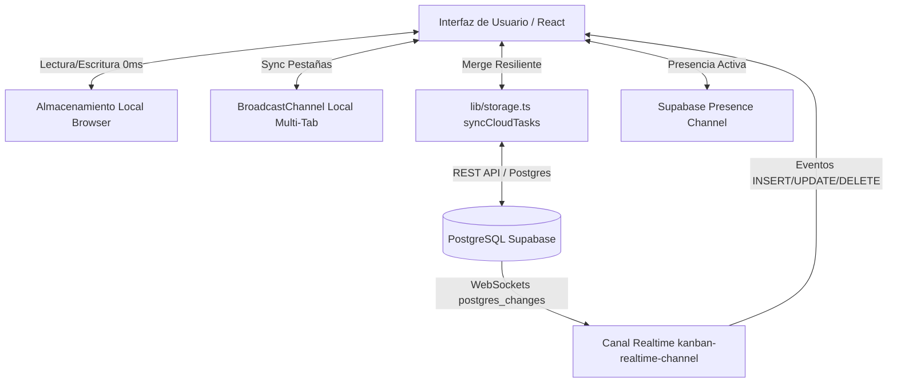

# 🛸 KANBAN//DUO — ESPECIFICACIÓN TÉCNICA DEL SISTEMA (SPEC v2.0)
> **Sistema Colaborativo Futurista de Gestión Ágil de Tareas, Proyectos, Telemetría y Personalización HUD en Tiempo Real**  
> **Versión**: 2.0.0-Production (Suite Completa de Productividad & HUD)  
> **Fecha de Actualización**: Septiembre 2026  
> **Zona Horaria del Sistema**: `America/Bogota` (UTC-5)  
> **URL Producción**: [https://kanban-duo-futurist.vercel.app](https://kanban-duo-futurist.vercel.app)  
> **Repositorio**: [https://github.com/Hssuarez/kanban-duo_futurist.git](https://github.com/Hssuarez/kanban-duo_futurist.git)

---

## 1. Resumen Ejecutivo y Filosofía de Diseño

### 1.1 Misión del Producto
**KANBAN//DUO** es una plataforma web colaborativa de alto rendimiento orientada a la gestión de tareas y misiones operativas para duplas y equipos multidisciplinarios. Fusiona la flexibilidad del tablero Kanban visual con telemetría de operadores en tiempo real, calendario interactivo tridimensional (Mes, Semana, Día), panel de métricas analíticas, suite de enfoque Pomodoro, sistema de checklist/subtareas, bitácora de comentarios y un motor visual HUD personalizable.

### 1.2 Filosofía Visual e Identidad (Cyberpunk Futurism & HUD)
- **Modo Oscuro Profundo OLED**: Paleta base de alto contraste `#070c18` / `#090f1f` con bordes semitransparentes reactivos (`border-cyan-500/25`, `border-white/[0.08]`).
- **Sistema Multitemático HUD Dinámico**:
  - `Cyber Cyan (#06b6d4)` [Default]: Cuántico / Clásico neón cian.
  - `Synthwave Violet (#a855f7)`: Neón retro púrpura y fucsia.
  - `Matrix Green (#10b981)`: Terminal bio-digital esmeralda.
  - `Solar Amber (#f59e0b)`: Aeroespacial ámbar y dorado cálido.
- **Microinteracciones y Audio Procedural Web Audio API**:
  - Cero archivos MP3 externos. 100% de síntesis procedural en el navegador mediante osciladores Web Audio API (`AudioContext`).
  - Chimes de confirmación, acordes armónicos mayores de éxito y retroalimentación háptica táctil (`navigator.vibrate`) en dispositivos móviles.
- **Tipografía y Microestética Sci-Fi**: Código monospaciado (`font-mono`) para identificadores, marcas temporales, cronómetros Pomodoro, barras de avance de subtareas y contadores de telemetría.

---

## 2. Arquitectura de Software y Modelo de Datos

### 2.1 Stack Tecnológico
| Capa | Tecnología | Versión | Propósito |
| :--- | :--- | :--- | :--- |
| **Framework Web** | Next.js (App Router) | `14.2.18` | Server Components, Client Hydration, API routes dinámicas |
| **Librería UI** | React / React DOM | `18.3.1` | Renderizado reactivo, portales y hooks de estado |
| **Lenguaje** | TypeScript | `^5.6.3` | Tipado estático riguroso (0 errores `tsc --noEmit`) |
| **Estilos** | Tailwind CSS | `^3.4.15` | Clases atómicas, variables CSS de temas HUD y layout responsive |
| **Iconografía** | Lucide React | `^0.460.0` | Iconos vectoriales semánticos |
| **Base de Datos & Realtime** | Supabase (PostgreSQL) | `@supabase/supabase-js ^2.46.1` | Almacenamiento nube, WebSockets Postgres Changes y Presence |
| **Efectos Visuales** | Canvas Confetti | `^1.9.3` | Celebración cinética al completar misiones |
| **Despliegue & CI/CD** | Vercel Platform | Integración continua | Alojamiento serverless en red perimetral con SSL automático |

---

### 2.2 Motor de Sincronización Dual Híbrido (Dual-Tier Architecture)

El sistema combina inmediatez local con persistencia en la nube:



1. **Capa Local (Zero Latency & Offline-Ready)**:
   - Toda interacción (mover tarjeta, agregar subtarea, alternar tag, comentar) se aplica en 0 ms en `localStorage`.
   - `BroadcastChannel('kanban_sync_local_v1')` propaga cambios entre pestañas sin requerir recargar la página.
2. **Capa Nube Resiliente (Supabase Cloud Tier)**:
   - Sincronización asíncrona no bloqueante con PostgreSQL.
   - `syncCloudTasks()` implementa una estrategia de fusión inteligente (*smart merge*): preserva los metadatos cliente extendidos (`subtasks`, `tags`, `comments`, `attachments`, `timeSpentSeconds`) ante respuestas del esquema básico en la nube.
3. **Endpoint de Autoconfiguración (`app/api/config/route.ts`)**:
   - Inyección en tiempo de ejecución de variables de entorno de Supabase sin recompilación del frontend.

---

### 2.3 Modelo de Entidades y Tipos (`lib/types.ts`)

```typescript
export type TaskStatus = 'iniciado' | 'trabajando' | 'finalizado';
export type TaskPriority = 'baja' | 'media' | 'alta';
export type UserRole = 'admin' | 'member';
export type SpaceFilter = 'all' | 'mine' | 'peer';
export type AppView = 'board' | 'calendar' | 'dashboard' | 'admin';
export type HudTheme = 'cyan' | 'violet' | 'matrix' | 'amber';

// 1. Subtarea / Checklist
export interface Subtask {
  id: string;
  title: string;
  completed: boolean;
  createdAt: string;
}

// 2. Comentario / Bitácora Interna
export interface TaskComment {
  id: string;
  userId: string;
  userName: string;
  userAvatar?: string;
  content: string;
  createdAt: string;
}

// 3. Recurso Externo / Adjunto
export interface TaskAttachment {
  id: string;
  title: string;
  url: string;
  type: 'link' | 'github' | 'figma' | 'doc';
}

// 4. Tarea (Esquema Completo de Misión)
export interface Task {
  id: string;
  projectId?: string;
  title: string;
  description?: string;
  status: TaskStatus;
  priority: TaskPriority;
  assignedTo: string;
  createdBy: string;
  createdAt: string;
  updatedAt: string;
  dueDate?: string;
  startedAt?: string;
  completedAt?: string;
  subtasks?: Subtask[];
  tags?: string[];
  comments?: TaskComment[];
  attachments?: TaskAttachment[];
  timeSpentSeconds?: number;
}

// 5. Usuario del Sistema
export interface User {
  id: string;
  name: string;
  email: string;
  avatar: string;
  color: string;
  role: UserRole;
  passwordHash: string;
  isActive: boolean;
  createdAt: string;
  lastLogin?: string;
}

// 6. Proyecto / Tablero
export interface Project {
  id: string;
  name: string;
  description?: string;
  color: string;
  createdBy: string;
  memberIds: string[];
  createdAt: string;
  updatedAt: string;
}

// 7. Histórico Inmutable de Estados
export interface TaskStatusHistory {
  id: string;
  taskId: string;
  previousStatus: TaskStatus | null;
  newStatus: TaskStatus;
  changedBy?: string;
  changedByName: string;
  createdAt: string;
  observations?: string;
}
```

---

## 3. Especificación de Módulos Funcionales

### 3.1 Tablero Kanban Dinámico (`KanbanBoard.tsx`, `Column.tsx`, `TaskCard.tsx`)
- **3 Columnas de Flujo Operativo**:
  - `Iniciado`: Tareas planificadas o en backlog.
  - `Trabajando`: Tareas activas en desarrollo. Cuenta con filamento de actividad neón animado en el borde inferior.
  - `Finalizado`: Tareas concluidas con onda expansiva (*Energy Completion Wave*) y confeti cinético.
- **Gestión de Carga de Trabajo (WIP Limits)**:
  - Límite recomendado de 5 tareas activas por columna. Si una columna supera el límite, se activa un badge de alerta pulsante (`⚠️ X/5 WIP`).
- **Ordenamiento Rápido de Columnas**:
  - Selector en cada columna para ordenar instantáneamente por: *Fecha de Vencimiento*, *Prioridad* (Urgente > Alta > Media > Baja) o *Más Recientes*.
- **Estados Vacíos Holográficos**:
  - Ilustración holográfica Sci-Fi con icono representativo, mensaje inspirador y botón de acción rápida `+ Iniciar tarea`.
- **Micro-indicadores en Tarjetas**:
  - Chips de tags coloreados con truncado inteligente (`max-w-[120px]`).
  - Barra de progreso HUD de subtareas (`[████░░] 3/5` o badge esmeralda radiante `✓ 5/5`).
  - Contadores de comentarios (`MessageSquare`) y recursos adjuntos (`Paperclip`).
  - Botón directo "Enfocar" en tareas en progreso para arrancar sesión de concentración Pomodoro.

---

### 3.2 Modal de Creación y Edición de Tareas (`TaskModal.tsx`)
- **Diseño Ergonómico Ampliado (`max-w-3xl`)**:
  - Ancho de hasta 768px para evitar cualquier corte o desborde en pantallas de escritorio y tablets.
  - Barra superior de 5 pestañas con navegación fluida y scroll táctil en dispositivos móviles:
    1. **General**: Título, descripción enriquecida, selector de estado, prioridad, responsable y fecha límite con zona horaria de Bogotá.
    2. **Subtareas**: Creación con atajo `Enter`, checklist interactivo, eliminación rápida y barra de porcentaje de completado.
    3. **Etiquetas (Tags)**: Selector de etiquetas sugeridas (`#Bug`, `#Feature`, `#Diseño`, `#Frontend`, `#Backend`, `#Urgente`) y creador de tags personalizadas.
    4. **Recursos**: Vinculación de especificaciones con autodetección de plataforma (Figma, GitHub, Docs, Links web).
    5. **Comentarios**: Hilo de notas internas con marca de tiempo precisa y avatar del autor.
- **Pie de Modal Fijo**: Botones de acción `Cancelar` y `Guardar cambios` con espacio holgado y contraste visual de alta visibilidad.

---

### 3.3 Calendario Multidimensional (`TaskCalendar.tsx`, `TaskDetailModal.tsx`)
- **Modos de Visualización**:
  1. **Mes (`month`)**: Rejilla mensual completa de 35 o 42 casillas con fecha normalizada de Bogotá.
     - **Ventana Flotante de Día (`day-task-popover`)**: Ampliada a `w-80 sm:w-96 md:w-[420px]` con altura de lista de hasta `320px`, fecha completa en cabecera y botón `+ Nueva tarea en este día`.
  2. **Semana (`week`)**: 7 columnas verticales (`min-h-[380px]`) con tarjetas arrastrables entre días para reprogramar fechas de entrega.
  3. **Día (`day`)**: Reingeniería completa de vista diaria con altura sólida (`min-h-[540px] sm:min-h-[620px]`):
     - Navegación rápida entre días (`◀ Anterior` / `Siguiente ▶`).
     - Métricas diarias en vivo: *Total*, *Por Iniciar*, *En Progreso*, *Completadas*.
     - Tarjetas de tarea completas con responsable, descripción, subtareas y estado.
     - Estado vacío holográfico con botón de planificación para la fecha.
- **Modal de Detalle de Tarea (`TaskDetailModal.tsx`)**:
  - Ventana ampliada (`max-w-2xl sm:max-w-3xl`) que expone la radiografía exhaustiva de la tarea:
    - Estado, prioridad y chips de etiquetas (#Tags).
    - Responsable y creador.
    - **Checklist de subtareas** con porcentaje de avance y casillas de verificación.
    - **Recursos externos** con iconos de Figma, GitHub, Docs y enlaces directos.
    - **Hilo de comentarios** con autor, fecha y contenido.
    - Cronología de tiempos (Fecha de creación, inicio, finalización y duración total).
    - Historial inmutable de cambios de estado auditado con observaciones.
    - Botón de acceso directo a edición (`Editar tarea`).

---

### 3.4 Modo Enfoque & Temporizador Pomodoro Sci-Fi (`lib/pomodoro.ts`)
- **Motor de Concentración de 25 Minutos**:
  - Cuenta regresiva con almacenamiento local persistente (no se reinicia al recargar o cambiar de pestaña).
  - Efectos de sonido procedurales con osciladores Web Audio API al iniciar (`playFocusStartSound`) y al concluir (`playFocusCompleteSound`).
- **Widget HUD en Navbar**:
  - Contador `MM:SS` en tiempo real con indicador radial/lineal de avance porcentual.
  - Botones de Pausa, Reanudación y Descarte.
- **Sincronización Automática con Modo Concentración (DND)**:
  - Durante la sesión activa, el sistema silencia notificaciones flotantes y sonidos no críticos para evitar distracciones operativas.

---

### 3.5 Sistema de Reportes Ejecutivos de Proyecto (`ProjectReportModal.tsx`)
- **KPIs Estratégicos de Proyecto**:
  - Total de tareas registradas.
  - Tasa global de finalización (%).
  - Avance promedio de subtareas.
  - Tareas en riesgo de vencimiento y tareas de prioridad alta.
- **Matriz de Productividad por Miembro**:
  - Asignadas vs Completadas por cada operador con barra de rendimiento porcentual.
- **Tabla Exhaustiva de Tareas Multi-Formato**:
  - **Imprimir / Guardar como PDF**: Formato de documento oficial con estilos limpios `@media print`.
  - **Descargar CSV**: Codificación UTF-8 con BOM para apertura inmediata en Microsoft Excel y Google Sheets.
  - **Copiar Markdown**: Texto formateado estructurado para bitácoras en Notion, GitHub o Slack.

---

### 3.6 Centro de Notificaciones Inteligente & Modo DND (`components/notifications/`)
- **Avisos Flotantes Holográficos (`NotificationToasts.tsx`)**:
  - Notificaciones flotantes en esquina superior derecha (escritorio) o banner superior centrado (móvil).
  - Auto-descarte tras 4.5 segundos con barra de progreso animada (`@keyframes toastProgress`).
  - Códigos de color HUD por severidad (Esmeralda = Completada, Ámbar = Vencimiento/Resumen, Rosa = Vencida/Estancada, Cian = Asignación).
- **Flujos de Alerta Automatizados**:
  - **Daily Briefing Matutino**: Saludo una sola vez al día con resumen de tareas que vencen hoy en Bogotá.
  - **Detección de Tareas Estancadas**: Alerta automática cuando una tarea lleva más de 5 días en la columna "Trabajando".
- **Notificaciones Nativas del Sistema Operativo (`browserNotifications.ts`)**:
  - API HTML5 de escritorio para avisos incluso con la pestaña minimizada.
- **Panel de Preferencias y Modo No Molestar (DND)**:
  - Presets de 1h, 2h y Todo el día con icono lunar en la campana del Navbar.
  - Ajustes granulares para activar/desactivar sonido, alertas de escritorio, resumen matutino y alertas de estancamiento.

---

### 3.7 Selector de Temas Visuales HUD (`lib/hudTheme.ts`, `globals.css`)
- **4 Paletas Visuales Conmutables**:
  - Accesibles desde el menú de usuario del Navbar y desde el modal de edición de perfil (`UserProfileModal`).
  - Aplicación inmediata a nivel de variable CSS en el elemento raíz `<html>` (`data-hud-theme="cyan|violet|matrix|amber"`).
  - Persistencia en almacenamiento local para recordar el tema preferido del usuario.

---

### 3.8 Telemetría y Presencia en Tiempo Real (`PeerActivityBar.tsx`)
- **Supabase Realtime Presence**:
  - Indicador verde pulsante (`LINK_STABLE // EN LÍNEA`) al abrir la plataforma.
  - Muestra la tarea que cada compañero está ejecutando activamente (`"EJECUTANDO AHORA"`).
  - Feed en vivo de las últimas 30 actividades registradas en el proyecto activo.

---

### 3.9 Administración y Perfiles de Usuario (`AdminPanel.tsx`, `UserProfileModal.tsx`)
- **Consola de Administración (`AdminPanel.tsx`)**:
  - Acceso restringido a rol `admin`.
  - Creación de cuentas, cambio de roles, suspensión de usuarios (`isActive`) y restablecimiento maestro de contraseñas.
  - Auditoría de seguridad cronológica (`security_logs`).
- **Edición de Perfil de Usuario (`UserProfileModal.tsx`)**:
  - Selector de tema HUD visual.
  - **Compresor de Avatares en el Cliente**: Reducción de imágenes de hasta 10 MB a WebP de 128x128 píxeles (~8-15 KB), ahorrando más del 99.7% de almacenamiento.
  - Generador procedural de avatares con DiceBear y presets visuales.
  - Cambio seguro de contraseña.

---

## 4. Garantías de Integridad y Restricciones del Sistema

1. **Pantalla de Login 100% Congelada e Inmutable**:
   - `components/LoginForm.tsx`, `components/Globe.tsx`, `components/InteractiveConstellationBackground.tsx` y `app/login/page.tsx` no deben ser modificados bajo ninguna circunstancia sin autorización explícita.
2. **Cero Rupturas de Esquema**:
   - Todos los campos nuevos (`subtasks`, `tags`, `comments`, `attachments`, `timeSpentSeconds`) son opcionales en el tipado de TypeScript.
   - Sincronización resiliente con Supabase para no sobreescribir ni truncar datos preexistentes.
3. **Control Horario Estricto**:
   - Todos los cálculos temporales de inicio, fin, vencimientos, resumen matutino y calendario se ejecutan bajo la zona horaria `America/Bogota` (UTC-5).
4. **Cero Consumo de Almacenamiento en Notificaciones**:
   - Los avisos, sonidos y registros del centro de notificaciones operan en memoria y almacenamiento local con buffer circular FIFO limitado a 100 elementos.

---

## 5. Matriz de Pruebas y Validación Técnica

| Módulo / Función | Tipo de Prueba | Estado | Resultado |
| :--- | :--- | :--- | :--- |
| **Tipado TypeScript** | `npx tsc --noEmit` | Validado | 0 errores en todo el proyecto |
| **Compilación de Producción** | `npm run build` | Validado | Next.js 14 empaquetó con éxito rutas estáticas y dinámicas |
| **Subtareas & Checklist** | Funcional & Visual | Validado | Progreso porcentual y estados completados en tarjetas y modales |
| **Filtro por Etiquetas** | Funcional | Validado | Filtrado reactivo en Kanban y píldora con botón de descarte |
| **WIP Limits & Ordenamiento** | Funcional | Validado | Badge de alerta a partir de 6 tareas y orden por fecha/prioridad |
| **Pomodoro Sci-Fi** | Funcional & Audio | Validado | Síntesis Web Audio procedural, timer persistente y auto-DND |
| **Reporte de Proyecto** | Funcional | Validado | Exportación probada en PDF, CSV (Excel) y Markdown |
| **Selector de Tema HUD** | Visual | Validado | Cambio dinámico entre Cyan, Violet, Matrix y Amber |
| **Ampliación Modal Tarea** | Responsive (<640px y >1024px) | Validado | Pestaña "Comentarios" 100% visible, sin cortes |
| **Vistas Mes y Día Calendario** | Visual & Layout | Validado | Popover espacioso en Mes y vista Día completa (`min-h-[540px]`) |
| **Detalle de Tarea** | Funcional & Visual | Validado | Subtareas, comentarios, tags y adjuntos visibles |
| **Integridad de Login** | Inspección Git | Validado | Cero cambios en componentes de login o constelaciones |
