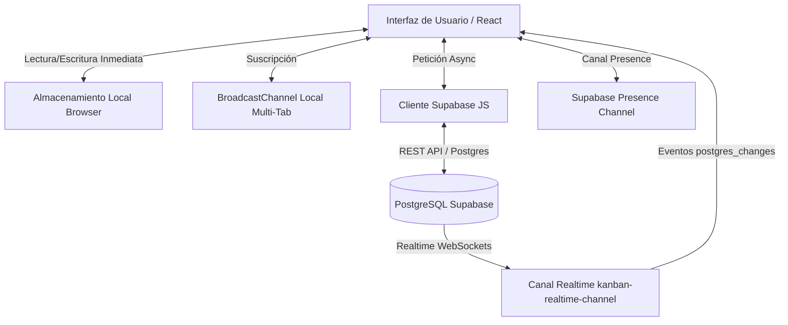
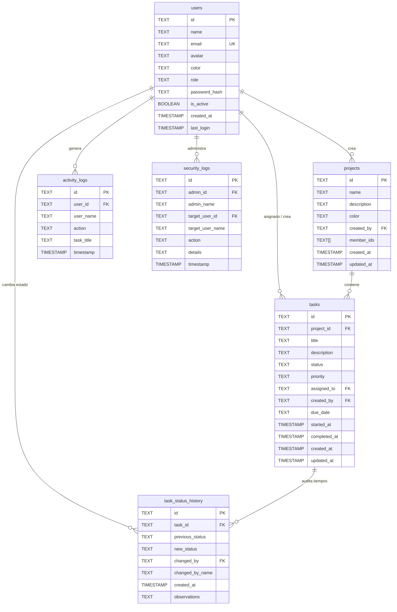

# 🛸 KANBAN//DUO — ESPECIFICACIÓN TÉCNICA DEL SISTEMA (SPEC v1.0)
> **Sistema Colaborativo Futurista de Gestión Ágil de Tareas, Proyectos y Telemetría en Tiempo Real**  
> **Versión**: 1.0.0-Production  
> **Fecha de Emisión**: Septiembre 2026  
> **Zona Horaria del Sistema**: `America/Bogota` (UTC-5)  
> **URL Producción**: [https://kanban-duo-futurist.vercel.app](https://kanban-duo-futurist.vercel.app)  
> **Repositorio**: [https://github.com/Hssuarez/kanban-duo_futurist.git](https://github.com/Hssuarez/kanban-duo_futurist.git)

---

## 1. Resumen Ejecutivo y Filosofía de Diseño

### 1.1 Misión del Producto
**KANBAN//DUO** es una plataforma web de alto rendimiento orientada a la gestión ágil de tareas colaborativas para duplas operativas y equipos multidisciplinarios. Combina la agilidad de un tablero Kanban con herramientas de telemetría de operadores en tiempo real, calendario interactivo multidimensional y un panel de analítica ejecutiva.

### 1.2 Filosofía Visual e Identidad (Cyberpunk Futurism)
- **Modo Oscuro Profundo OLED**: Fondo base `#080a11`, contenedores `#0b0e18`/`#101423` con bordes semitransparentes (`border-cyan-500/30`, `border-slate-800`).
- **Paleta Neón Funcional**:
  - `Cyan (#06b6d4)`: Identidad del sistema, estado **Iniciado**, enlaces y acciones principales.
  - `Ámbar (#f59e0b)`: Estado **Trabajando**, alertas de advertencia y prioridad media.
  - `Esmeralda (#10b981)`: Estado **Finalizado**, operadores en línea y métricas de éxito.
  - `Rosa / Fucsia (#f43f5e / #d946ef)`: Prioridad alta, vencimientos críticos y celebraciones.
  - `Índigo (#6366f1)`: Consola de Administración y seguridad.
- **Tipografía y Estética HUD**: Tipografía monospace (`font-mono`) en etiquetas, códigos de comando (`// MI ESPACIO`, `CONSOLE//ADMIN`, `TELEMETRÍA //`), bordes con resplandor (*glow effect*) y microinteracciones de pulso.
- **Micro-feedback Emocional**: Integración de confeti cinético (`canvas-confetti`) sincronizado al finalizar tareas o metas del sprint.

---

## 2. Arquitectura de Software y Modelo de Datos

### 2.1 Stack Tecnológico
| Capa | Tecnología | Versión | Propósito |
| :--- | :--- | :--- | :--- |
| **Framework Web** | Next.js (App Router) | `14.2.18` | Enrutamiento moderno, Server Components, API routes dinámicas |
| **Librería UI** | React / React DOM | `18.3.1` | Renderizado declarativo con hooks y estado reactivo |
| **Lenguaje** | TypeScript | `^5.6.3` | Tipado estricto de extremo a extremo |
| **Estilos** | Tailwind CSS | `^3.4.15` | Utilidades CSS atómicas, temas cyberpunk y diseño responsive |
| **Iconografía** | Lucide React | `^0.460.0` | Iconos vectoriales consistentes |
| **Base de Datos & Realtime** | Supabase (PostgreSQL) | `@supabase/supabase-js ^2.46.1` | Persistencia en la nube, RLS, WebSockets Postgres Changes y Presence |
| **Efectos Visuales** | Canvas Confetti | `^1.9.3` | Animaciones de celebración en el cliente |
| **Despliegue** | Vercel Platform | CI/CD Git-driven | Hosting serverless global con SSL automático |

---

### 2.2 Motor de Almacenamiento Dual Híbrido (Dual-Tier Storage Engine)

El sistema implementa una arquitectura híbrida de sincronización reactiva bidireccional que asegura funcionamiento sin conexión, latencia percibida de 0 ms y persistencia en la nube:



1. **Nivel Local (Local Tier - Zero-Latency)**:
   - Toda lectura y actualización se refleja inmediatamente en `localStorage`.
   - Canal `BroadcastChannel('kanban_sync_local_v1')` sincroniza pestañas abiertas en el mismo navegador sin recargar.
2. **Nivel Nube (Cloud Tier - Supabase PostgreSQL)**:
   - Las operaciones de creación, actualización y eliminación se replican asíncronamente en PostgreSQL.
   - Si la red falla o está degradada, la interfaz continúa operativa localmente sin bloquear al usuario.
   - Un canal WebSocket `kanban-realtime-channel` escucha eventos `INSERT`, `UPDATE` y `DELETE` en las tablas `projects`, `users`, `tasks` y `task_status_history`.
3. **Autoconfiguración Dinámica (`app/api/config/route.ts`)**:
   - Endpoint seguro en el servidor Next.js que expone las credenciales públicas de Supabase inyectadas por variables de entorno sin necesidad de recompilación en tiempo de ejecución.

---

### 2.3 Modelo de Entidades y Tipos (`lib/types.ts`)

```typescript
export type TaskStatus = 'iniciado' | 'trabajando' | 'finalizado';
export type TaskPriority = 'baja' | 'media' | 'alta';
export type UserRole = 'admin' | 'member';
export type SpaceFilter = 'all' | 'mine' | 'peer';
export type AppView = 'board' | 'calendar' | 'dashboard' | 'admin';

// 1. Usuario del Sistema
export interface User {
  id: string;
  name: string;
  email: string;
  avatar: string;
  color: string;
  role: UserRole;
  passwordHash: string;
  isActive: boolean;
  createdAt: string;
  lastLogin?: string;
}

// 2. Tablero de Proyecto
export interface Project {
  id: string;
  name: string;
  description?: string;
  color: string;
  createdBy: string;
  memberIds: string[];
  createdAt: string;
  updatedAt: string;
}

// 3. Tarea
export interface Task {
  id: string;
  projectId?: string;
  title: string;
  description?: string;
  status: TaskStatus;
  priority: TaskPriority;
  assignedTo: string;
  createdBy: string;
  createdAt: string;
  updatedAt: string;
  dueDate?: string;
  startedAt?: string;
  completedAt?: string;
}

// 4. Histórico Inmutable de Estados (Auditoría de Tiempo)
export interface TaskStatusHistory {
  id: string;
  taskId: string;
  previousStatus: TaskStatus | null;
  newStatus: TaskStatus;
  changedBy?: string;
  changedByName: string;
  createdAt: string;
  observations?: string;
}

// 5. Logs de Actividad de Tareas
export interface ActivityLog {
  id: string;
  userId: string;
  userName: string;
  action: string;
  taskTitle: string;
  timestamp: string;
}

// 6. Logs de Seguridad y Auditoría Administrativa
export interface SecurityLog {
  id: string;
  adminId: string;
  adminName: string;
  targetUserId?: string;
  targetUserName?: string;
  action: string;
  details: string;
  timestamp: string;
}
```

---

## 3. Esquema de Base de Datos (Supabase / PostgreSQL)

### 3.1 Tablas y Relaciones
El esquema de base de datos se encuentra normalizado, con claves foráneas e integridad referencial en cascada:



### 3.2 Índices de Rendimiento
Para acelerar las consultas analíticas del Dashboard y la vista de Calendario:
- `idx_projects_created_by` sobre `public.projects(created_by)`
- `idx_tasks_project_id` sobre `public.tasks(project_id)`
- `idx_tasks_assigned_to` sobre `public.tasks(assigned_to)`
- `idx_tasks_started_at` sobre `public.tasks(started_at)`
- `idx_tasks_completed_at` sobre `public.tasks(completed_at)`
- `idx_tsh_task_id` sobre `public.task_status_history(task_id)`
- `idx_tsh_created_at` sobre `public.task_status_history(created_at)`
- `idx_logs_timestamp` sobre `public.activity_logs(timestamp)`

---

## 4. Módulos y Funcionalidades del Sistema

### 4.1 Módulo Multi-Proyecto y Tableros Compartidos
- **Aislamiento por Tablero**: Cada proyecto posee sus propias tareas, miembros asignados y métricas.
- **Acceso Granular**:
  - Los administradores pueden visualizar todos los tableros.
  - Los miembros regulares solo tienen acceso a los tableros creados por ellos o compartidos explícitamente a través de `memberIds`.
- **Proyecto Base ('proj-default')**: Tablero central "Protocolo Alpha" protegido contra eliminación accidental.
- **Selector Responsive Inteligente**: En escritorio se ubica en el Navbar; en teléfonos móviles se despliega en una barra dedicada horizontal con soporte para texto truncado y navegación táctil rápida.

### 4.2 Tablero Kanban y Motor de Tareas
- **3 Columnas de Flujo de Trabajo**:
  - `Iniciado` (🟦 Cyan): Tareas planificadas o en cola. Registra automáticamente `started_at` en su primera transición.
  - `Trabajando` (🟧 Ámbar): Tareas activamente en desarrollo por un operador.
  - `Finalizado` (🟩 Esmeralda): Tareas completadas. Registra `completed_at` y dispara confeti visual.
- **Filtros por Espacio de Operador**:
  - `// MI ESPACIO`: Muestra exclusivamente las tareas asignadas al usuario activo.
  - `// ESPACIO PEER`: Enfocado en el compañero de trabajo seleccionado.
  - `// REJILLA DE EQUIPO`: Visión integral de todas las tareas del tablero.
  - *Comportamiento Inteligente*: Al crear una tarea asignada a un colega desde "Mi Espacio", el sistema conmuta automáticamente a la "Rejilla de Equipo" para que la tarea no quede oculta.
- **Arrastre y Soltado (Drag & Drop)**: Implementación nativa HTML5 Drag & Drop fluida con estados visuales de hover neón (`isDragOver`).
- **Botones de Ejecución Rápida**: Atajos directos en cada tarjeta (`EJECUTAR`, `PAUSAR`, `COMPLETAR`, `REABRIR`).

### 4.3 Telemetría y Presencia en Tiempo Real (`PeerActivityBar`)
- **Supabase Realtime Presence**: Conexión bidireccional WebSocket que detecta automáticamente cuando un usuario abre la aplicación en cualquier dispositivo y marca su indicador en verde pulsante (`LINK_STABLE // EN LÍNEA`).
- **Detección de Tarea Activa**: Muestra en tiempo real qué tarea está ejecutando actualmente el operador (`"EJECUTANDO AHORA"`).
- **Feed Desplegable de Actividad**: Registro en vivo de las últimas 30 acciones de tareas (creaciones, cambios de estado, eliminaciones).

### 4.4 Vista de Calendario Operativo (`TaskCalendar`)
- **Modos de Vista**: Mensual, Semanal y Diario.
- **Normalización Horaria de Bogotá (`America/Bogota` UTC-5)**: Todas las fechas límite (`dueDate`) y fechas de inicio/fin se calculan estrictamente en la zona horaria colombiana sin desfasajes de UTC.
- **Alertas de Vencimiento**: Distintivo rojo neón cuando una tarea supera su fecha límite sin haber finalizado.
- **Modal de Detalle Rápido (`TaskDetailModal`)**: Vista de inspección con cálculo de duración y opciones de edición.

### 4.5 Panel de Analítica y Rendimiento Ejecutivo (`TaskDashboard`)
- **Métricas Clave (KPIs)**:
  - Total de Tareas en el periodo seleccionado.
  - Tasa de Finalización (% completado vs total).
  - Tiempo Promedio de Ciclo (Lead Time / Cycle Time en horas y días).
  - Puntuación de Velocidad Operativa (*Velocity Index*).
  - Conteo de Tareas Vencidas.
- **Filtros Temporales Rápidos**: *Hoy*, *Esta Semana*, *Este Mes*, *Mes Anterior*, o *Rango Personalizado*.
- **Desglose por Operador**: Comparativa de rendimiento individual (tareas asignadas vs completadas y tiempos de resolución).
- **Generador de Reportes Mensuales (`MonthlyReportModal`)**:
  - Resumen ejecutivo formal listo para auditorías o rendición de cuentas de fin de mes.
  - Formato imprimible y exportable.

### 4.6 Panel de Administración y Seguridad (`AdminPanel`)
- Acceso exclusivo para usuarios con rol `admin`.
- **Gestión de Usuarios**: Creación de nuevas cuentas, edición de perfiles, alternancia de rol (`admin`/`member`) y suspensión de acceso (`isActive`).
- **Restablecimiento Maestro de Contraseñas**: Modal con advertencias de seguridad para asignar nuevas credenciales temporales.
- **Auditoría de Seguridad Inmutable**: Visualización cronológica de eventos críticos en `security_logs`.

---

## 5. Optimizaciones Críticas Implementadas

### 5.1 Compresor de Avatares en el Cliente (`lib/imageUtils.ts`)
Para evitar el alto consumo de almacenamiento y costos en bases de datos:
1. El usuario selecciona cualquier fotografía (incluso de 5 a 15 MB tomada desde un smartphone moderno).
2. Se procesa en el navegador mediante la API HTML5 Canvas:
   - Se realiza un recorte centrado proporcional (`aspect-fill`).
   - Se escala a una resolución óptima de **128 x 128 píxeles**.
   - Se exporta a formato **WebP** al 82% de calidad (con fallback automático a JPEG).
3. **Resultado**: La imagen se reduce a un string Base64 de entre **8 y 15 KB** (>99.7% de ahorro), permitiendo almacenarla directamente en la columna `avatar` sin saturar la cuota de almacenamiento de Supabase.

### 5.2 Diseño Responsivo Móvil Avanzado
- **Navbar en 3 Niveles en Móvil**:
  - Fila 1: Logo + Acciones rápidas (Admin, + Tarea, Menú de usuario).
  - Fila 2: Selector horizontal completo de Tableros/Proyectos con texto truncado seguro.
  - Fila 3: Navegación horizontal táctil entre Kanban, Calendario y Dashboard sin saltos de línea desordenados.
- **Protección de Textos Largos**: Aplicación de `truncate`, `max-w-[...]` y nombres compactos en pantallas de menos de 640px para evitar desbordamientos horizontales.

---

## 6. Configuración de Entorno y Variables

| Variable | Descripción | Ejemplo / Formato |
| :--- | :--- | :--- |
| `NEXT_PUBLIC_SUPABASE_URL` | URL del proyecto Supabase | `https://ckwqsaygxmrgplwruglx.supabase.co` |
| `NEXT_PUBLIC_SUPABASE_ANON_KEY` | Clave anónima pública de Supabase | `eyJhbGciOiJIUzI1NiIsInR5cCI6...` |

---

## 7. Próximos Pasos y Roadmap Sugerido

1. **Notificaciones Push PWA**: Alertar a los miembros cuando se les asigne una nueva tarea o se aproxime una fecha límite.
2. **Adjuntos de Archivos Comprimidos**: Permitir adjuntar capturas de pantalla o PDFs ligeros en los comentarios de cada tarea.
3. **Subtareas y Checklists**: Listas de verificación dentro de cada tarjeta para tareas complejas.
4. **Exportación a CSV / Excel**: Descarga de reportes en hojas de cálculo directamente desde el Dashboard.
